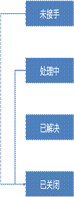

# 2.2    告警的生命周期
  
告警生命周期状态有：未接手、处理中、已解决、已关闭。
- 未接手：首次创建即此状态
- 处理中：触发了通知（邮件，短信，chatops私聊）/派发工单的动作即此状态
- 已解决：ITSM工单完成回调/界面触发/API调用解决动作即此状态
- 已关闭：界面触发/API调用关闭动作即此状态（关闭后代表告警的生命周期结束，相同的告警进来会重新生成一条告警）

